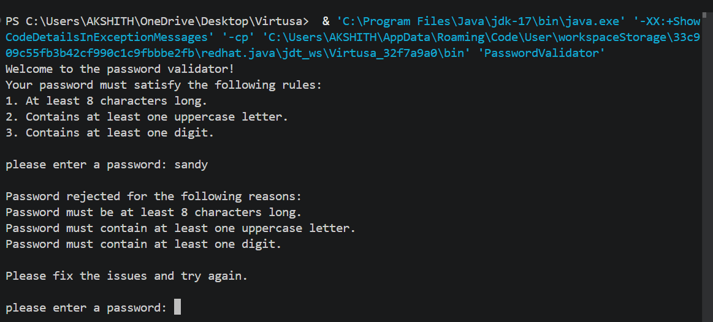

# Safelog-Password-Validator

This is a basic Java program that checks if a password is valid. The password must be at least 8 characters long, have one uppercase letter, and include one number. If the password is wrong, the program shows the errors and asks again. It keeps running until a correct password is entered.

## Output

